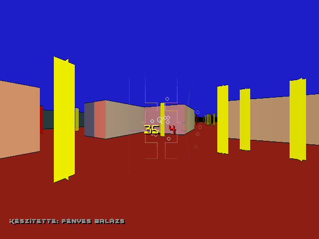

# raycast

Important: the **contents** of the `font`, `lib`, `dat` folders have to move into the executable file's directory.

In the `bin` folder you will find the compiled program.

For more information visit [my website](https://fenyesb.github.io/projects/raycast.html).
